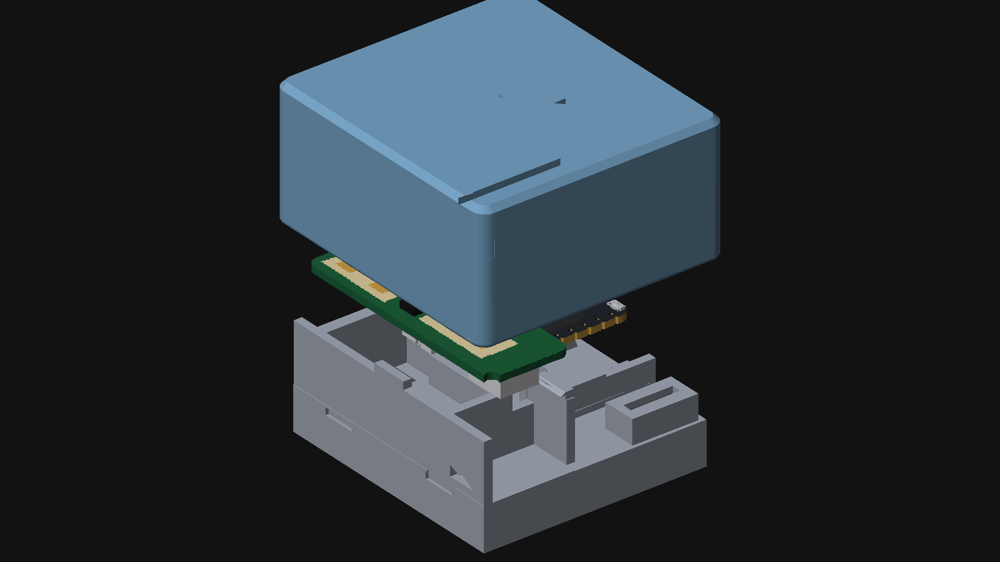
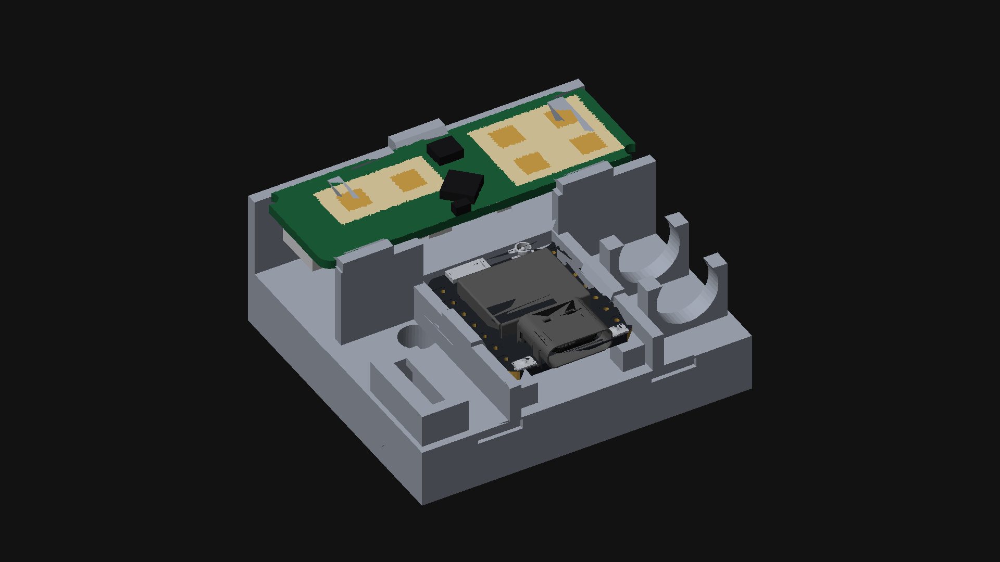
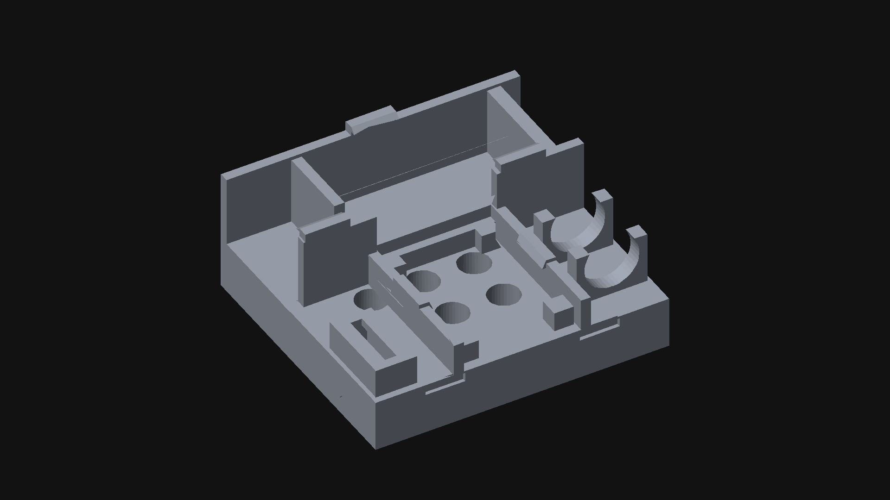
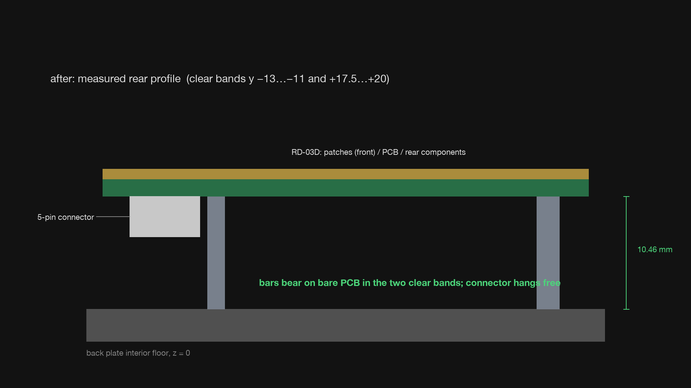
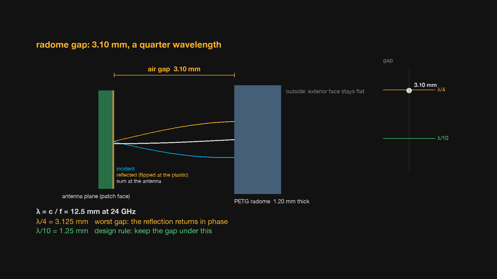
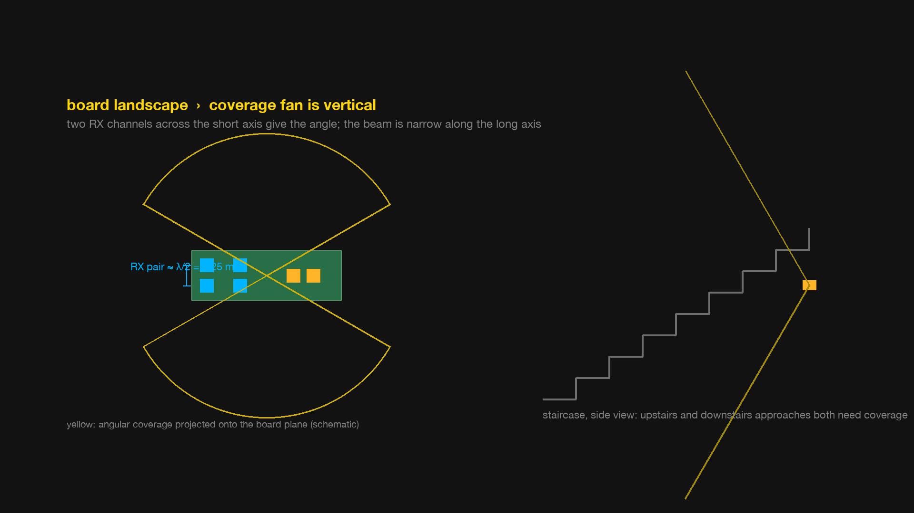

# RD-03D stair radar

A 24 GHz radar in a 3D-printed case watches a staircase and turns the light on before anyone reaches the first step, then off a minute after they are gone. The sensor is an Ai-Thinker RD-03D, the controller a Seeed XIAO ESP32-C6, the automation a four-node Node-RED flow. Nearly all of the firmware, the web chart, the flow and the enclosure CAD were written by an AI agent over four weeks of evenings, with the CAD built by driving a live Fusion 360 session through its scripting API. The write-up below is about how that went, and about the places where the reviewing human earned his keep.



## What is in this repository

| Path | What it is |
| --- | --- |
| `rd03d_uart/` | ESP-IDF firmware for the XIAO ESP32-C6: radar frame parser, live browser chart over WebSocket, MQTT events, OTA with rollback, station and access-point images. Host-side unit tests in `tests/`. |
| `case/` | The two-part snap-fit case: STLs ready to print, and the numbered Fusion 360 Python scripts that are the actual design, plus the read-only geometric probe harness `90_verify.py`. |
| `node-red/` | The stair-light flow, a validator, and an MQTT acceptance test. |
| `RD03D_RadarChart/` | The original Processing visualiser for the sensor over USB serial, kept for reference. |
| `docs/superpowers/` | The ten dated design specs and implementation plans the agent worked from, in the order they were written. |
| `video/` | The pipeline that synthesised the project video: frame generator, narration, STEP-to-mesh converter, and the rendered figures used below. |

Each of the first three directories has its own README with the details. The rest of this page is the quick start and the story.

## Quick start

Wire the radar to the XIAO: radar TX to D7 (GPIO17), radar RX to D6 (GPIO16), 5 V and GND. The radar UART runs at 256000 baud, 8N1.

Build and flash with ESP-IDF v5.5. The WiFi SSID and password live only in the untracked `sdkconfig`, set through `idf.py menuconfig` under *RD03D Configuration*.

```bash
cd rd03d_uart
idf.py set-target esp32c6
idf.py menuconfig          # RD03D Configuration: WiFi SSID / password, MQTT broker
idf.py build
idf.py -p /dev/cu.usbmodemXXXX flash monitor
```

Open `http://rd03d.local` on the same network for the live chart. After the first USB flash, updates go over WiFi and roll back by themselves if the new image fails to come up within 90 s:

```bash
idf.py build && curl -X POST --data-binary @build/rd03d_uart.bin http://rd03d.local/update
```

For a site where the device cannot join the WiFi, build the access-point image instead. It brings up its own network, `rd03d-radar`, serves the chart at `http://192.168.4.1`, and compiles MQTT out:

```bash
idf.py -B build.ap -D SDKCONFIG=sdkconfig.ap build
```

The station image publishes `rd03d/target/1..3` as `{"x","y","v"}` in millimetres and centimetres per second whenever a target appears or has moved more than 200 mm, `{"gone":true}` when it leaves, and a retained `rd03d/status` of `online` or `offline`. Import `node-red/flows-stair-light.json` into Node-RED, change the relay topic in the node marked *EDIT DEVICE*, tune the zone in the node marked *EDIT ZONE* using the chart, and deploy. `node-red/test_stair_flow.py` exercises the flow with synthetic events.

Print the case in PETG, 0.2 mm layers, no supports, with the shell at high infill so the radome in front of the antennas is solid plastic. Fit the USB-C jack before the boards. The six holes in the back are LEGO Technic pitch, for a ball-joint mount. The full assembly order, including why the jack goes in from the back and is soldered afterwards, is in `case/README.md`.

The host tests need nothing but a C compiler:

```bash
cd rd03d_uart/tests
cc -Wall -Wextra -o test_rd03d test_rd03d.c ../main/rd03d.c && ./test_rd03d
cc -Wall -Wextra -o test_mqtt_throttle test_mqtt_throttle.c ../main/mqtt_throttle.c && ./test_mqtt_throttle
```

## A radar stair light, built with an AI co-engineer

The gadget is a weekend's work for anyone reading this and not worth an article. What is worth an article is that over four weeks of evenings, from the end of August to late September, an AI agent wrote essentially all of the firmware, the web interface, the home-automation flow, and the CAD for the enclosure, and that the CAD was done by driving my own copy of Fusion 360 directly rather than by emitting a file for me to import. My job turned into something closer to a reviewing engineer and lab tech than a designer, and I caught the agent out often enough that the review was not a formality. I think the shape of that collaboration maps directly onto any one-off hardware build: the bracket, the jig, the sensor-in-a-box that most of us design once and never document.

### What got built

The sensor is an Ai-Thinker RD-03D, a 24 GHz FMCW module with one transmit patch pair and a 2×2 receive array that tracks up to three targets and spits out x, y and radial velocity over a 256 kbaud UART, thirty bytes per frame. It is wired to a Seeed XIAO ESP32-C6, a thumbnail-sized RISC-V board with 2.4 GHz WiFi. The firmware is ESP-IDF, about 1,450 lines of C including the host tests. It parses the radar frames, serves a live radar plot in a browser at a local mDNS name over a WebSocket at about 11 Hz, publishes target events over MQTT to a Mosquitto broker, takes over-the-air firmware updates with automatic rollback if a new image fails to come up, and can be built as a second variant that is its own WiFi access point with MQTT compiled out, for places where you cannot put a stray device on the network. A Node-RED flow on a Raspberry Pi subscribes to the target topics, applies a zone filter, holds the light on with a retriggerable 60 s timer and drives a Tasmota relay.

The enclosure is a two-part snap-fit case: an 8 mm back plate carrying the radar bay, the XIAO posts, five cantilever retention clips, a USB-C power jack with its decoupling capacitor cradled inside, and six LEGO Technic pin holes on 8 mm pitch so the whole thing hangs off a Technic ball joint for aim adjustment. The front shell has a thinned radome step over the antennas and a hold-down boss over the XIAO's RF can. It printed in PETG on a 0.6 mm nozzle with no supports, after seven revisions of the plate.



### How the firmware side went

The working pattern was the same for every feature. I described what I wanted in a paragraph. The agent wrote a short design spec, I read it and argued with it, then it wrote a numbered implementation plan and executed it, testing as it went. Ten of those spec-and-plan pairs are in `docs/superpowers/`, dated, and they read like a lab notebook. The UART reader came first, with the frame parser written as plain C and unit-tested on the Mac before it ever touched the board. The WiFi web chart came next, then OTA, then MQTT, then the Node-RED flow, then the access-point variant, each as a branch merged after a hardware check.

The useful discipline here was that the agent insisted on testable seams. The radar parser and the MQTT throttling logic, which decides that a target has to move 200 mm before a new event is worth publishing, are pure functions with nineteen host-side tests between them. The OTA path got a deliberate drill: we flashed an image that was built to fail, watched it boot, fail to bring up its web server inside the 90 s window, and roll itself back to the previous image in about 95 s. The browser-side verification was equally direct. The agent opened the chart in a browser, walked the WebSocket, and read the HUD back to confirm the firmware version it had just flashed.

It also walked into the kind of traps that any of us would have, and had to dig out. Two examples. The ESP-IDF web server does not call your URI handler during a WebSocket handshake, so the client-tracking pattern in the first draft was dead code, and clients had to be enumerated from the server's own list instead. More subtly, the access-point variant kept rolling back after every OTA while USB flashing worked fine. The rollback-cancel was gated on "we have an IP address", and in AP mode no IP event ever fires. The fix was one line. Finding it was an evening. None of this is a criticism of the tool so much as a reminder that it is doing real engineering with the same documentation we have, and the documentation lies in the same places.

### How the CAD side went, which is the part I want you to see

The enclosure was not designed by generating a mesh. Autodesk ships a Model Context Protocol server for Fusion 360, which is a small local HTTP endpoint that lets an agent run Python against the live Fusion API inside your open document. The agent wrote a driver that speaks that protocol, `case/fusion_scripts/run_fusion.py`, then built the case as a sequence of numbered Python scripts: set up user parameters, build the back plate, build the shell, place reference bodies for the two boards, export STLs. About 1,900 lines of Python in all, and those scripts are the design. Every feature in the plate, every clip, ramp, counterbore and wire notch, is a few lines in a script that reads like a construction record, with the dimension and the reason next to each other. When something had to change, the agent edited the script and re-ran it, and Fusion rebuilt the body. I watched it happen in the Fusion window.

Two things about this were new to me. The first is that a scripted design is reviewable in the way code is reviewable. I could read a diff and see that a rib had moved from x 3.0 to x 5.6 and why. Try doing that with a feature tree. The second is that the agent wrote itself a verification harness. The last script in the sequence, `90_verify.py`, is read-only: it probes the finished bodies with point-containment queries, asking Fusion "is there material at this coordinate" at a few dozen points, and asserts that the walls are where the spec says, that the counterbores are open, that the USB jack slot is clear, that a rib is not roofing a LEGO bore. It caught exactly that last one, a capacitor rib placed over a pin hole, before I printed it. That is a unit test for a mechanical part, and I had never seen one.



### Where the human earned his keep

The honest part of the story is the list of things the agent got confidently wrong and I caught, usually by holding the printed part or staring at the Fusion model. I am including it because it is the real argument for this way of working: the agent is fast and tireless and does not know what it does not know, and a reviewing engineer who does is the thing that makes the pair better than either alone.

The board was resting on its connector. The agent had sized the crossbars under the radar PCB from the board's overall thickness, which includes a 5-pin connector that protrudes rearward. The bare PCB back is actually 3.8 mm further in. So as designed the radar sat on its connector and nothing else. I spotted that in the Fusion model; the agent then probed the vendor's board model, found two component-free bands, and moved the crossbars to bear on bare PCB with the connector hanging free between them.



The radome was tuned to the worst possible gap. This one is the physics lesson, and I want to spell it out. At 24 GHz the free-space wavelength is λ = c/f = 12.5 mm. The agent had, several times, assured me the air gap between the antenna face and the inside of the radome was about 1 mm. It had anchored that number on the top of the board's bounding box, which is the tallest IC, not the antenna plane. The true antenna-to-radome gap, after a well-meaning change that moved the window pocket to the inside face, was 3.1 mm. A quarter wavelength is λ/4 = 3.125 mm. A quarter-wave gap is the anti-resonance case: the wave reflected off the radome's inner surface travels an extra half wavelength out and back, picks up the phase flip at the plastic boundary, and arrives back at the antenna in phase with the transmitted wave, which is the maximum possible mismatch. It is the same reason an anti-reflection coating is a quarter wave thick, run backwards. The rule I gave the agent and it then designed to was to keep the gap under λ/10, about 1.25 mm, where the reflected field has not had room to rotate far. The fix brought the radome down to a 1.21 mm gap over both antenna groups, with the plastic in front of them a solid 3.1 mm, and the exterior face stays flat. I would not have caught this from the script. I caught it from a section view.



The antenna was going in sideways. The two receive channels that give the module its angle measurement are spaced across the board's short axis, about λ/2 apart. That means the wide ±60° field of view opens across the board's width, and the beam is narrow along its length. I had assumed the opposite. For a staircase, where the sensor must tell an upstairs approach from a downstairs one, the fan has to be vertical, so the board mounts landscape. This was a fifteen-second conversation once the antenna geometry was on the table, and the kind of thing anyone who has laid out a patch array would catch before coffee.



The printer disagreed with the design. The first plate design had 0.6 mm fence walls and a shallow tape recess on the back face. I print with a 0.6 mm nozzle, so a 0.6 mm wall is at best one wobbly extrusion, and the recess meant the first layer was a thin rim with nothing in the middle. Both came out. All walls are now at least 1.5 mm, and the back is one flat face. Later the agent designed the XIAO clips as slender slotted fingers with the root trenched below the floor to keep bending strain near two percent in PETG, which is correct and which held the board about as firmly as a wet noodle. The slots and trenches came out and the clip is now a plain stretch of the 1.5 mm wall with a 0.6 mm lip. It takes a firm push to click the board in. That is fine. The agent's analysis was right about strain and wrong about what "holds" means to a thumb.

And the diagnosis that cost an hour: curl to the device's mDNS name hung every time while a browser worked. The device advertises an IPv6 link-local address over mDNS that is not routable from the Mac, curl tries it first and waits out its timeout. Forcing IPv4 fixes it. Not a device fault at all, and the agent and I both chased ghosts in the firmware before checking.

### What this means for your next part

Most of what gets printed in a home shop is a one-off: a bracket for a sensor, a jig to hold a board while you solder it, a mount for a camera, a box for the thing you just built. The loop I ran here, which is describe the part, have the agent build it parametrically in Fusion with a probe harness, print it, hold it, correct it, re-run the script, is the loop we already run with a human at the keyboard, only the keyboard part now takes minutes instead of an afternoon and leaves a reviewable script behind it. A part designed this way comes with its construction rationale and its own geometric self-test, and you, or anyone who forks this repo, can re-run it with a different board outline next year. None of this depends on Fusion. Any CAD package with a scripting API can be driven the same way: FreeCAD and OpenSCAD are scripting-native, Onshape has a REST API, and SolidWorks has a mature COM automation interface that is if anything an easier target than Fusion's.

The firmware side is the same story. A sensor on a serial port that logs to a broker and shows a live plot in a browser is exactly the sort of thing we build for a weekend project and then never document. Here the spec, the plan, the tests and the OTA path came along for free, because the agent will not skip them unless you tell it to.

Three cautions, briefly. First, the agent's confidence is uncorrelated with its correctness on anything it cannot measure, which in CAD is everything. Every print I did without a section view first was a print I did twice. Second, the physics still has to come from somewhere, and in this project it came from me and from the datasheet. The λ/4 mistake would have shipped. Third, treat the scripts, not the live CAD document, as the source of truth, and keep them under version control. The one time I let the agent tune a parameter in the Fusion UI instead of the script, the next re-run of the setup script silently reset it.

## Parts

- Ai-Thinker RD-03D 24 GHz radar module
- Seeed Studio XIAO ESP32-C6
- USB-C receptacle breakout with 5.1 kΩ CC pull-downs, 100 µF capacitor
- Raspberry Pi running Mosquitto and Node-RED
- Tasmota-flashed relay or smart plug
- PETG filament, 0.6 mm nozzle, no supports, shell at high infill so the radome is solid plastic
- Six LEGO Technic pins and a ball-joint arm for mounting

## Video

A synthesised walkthrough of the project, rendered from the STLs, the vendor board models and the real source files in this repository, is on YouTube: https://youtu.be/SwnVpzrGE3c. The video's script, this README and the write-up above were drafted by the AI agent (Claude Code), then reviewed and corrected by the author. The pipeline that produced the video is in `video/`; the board STEP models it uses are third-party downloads and are not redistributed here.

## Licence

Code is MIT (`LICENSE`). The write-up, documents, STL files and figures are CC BY 4.0 (`LICENSE-CC-BY-4.0.md`).
